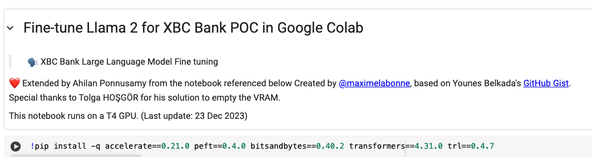

# LLM-and-AppModerization - Fine Tuning

## Detailed explanation of this POC is provided in this [blog](https://medium.com/@ahilanp/part-ii-poc-beyond-the-buzz-highlighting-the-impact-of-ai-in-modernizing-application-ff0c1e8efb87) ##

This comprehensive guide provides step-by-step instructions for configuring and running Llama2 on a MacBook. While tailored for macOS, the instructions are adaptable for Windows machines as well. 
The following is the sysem specification that I used for building this project, I do believe a lower configuration will work just fine.

**System Specifications:**

- Device: MacBook Pro
- Processor: 2.6 GHz 6-Core Intel Core i7
- RAM: 32 GB 2667 MHz DDR4

Follow the outlined steps to seamlessly set up Llama2 on your local environment. You may be able to follow the instruction for both Mac or Windows machine.

## Prerequisites

1. I used Google Colab (https://colab.research.google.com/?utm_source=scs-index) for this task. While the free version might work sometimes, it can be slow, or you might get timed out because of limited resources. I strongly suggest either getting compute units under the **Pay As You Go** model or subscribing to Colab Pro. For this task, I bought 100 Pay As You Go compute units. Even after all the testing, I only used 18 compute units, which cost around $2 USD.

2. Open **Fine-Tuning/XBC_Fine_tune_Llama_2_in_Google_Colab.ipynb**. Right click on **Open in Colab** button on the top left corner. and open it in a new tab. It will open the the script in Google Colab. 

3. Create a folder called **data** by selecting the "New Folder" option on right click as shown below.
   

4. Download **train.csv** file from this folder(Fine-Tuning Folder) and upload it to **Colab->data** folder that you just created by selecting **Upload** option on right click as shown below.
   


5. You are all set to execute the Fine tuning script now. Execute one cell at a time by clicking on the Run button as shown below
   

>[!WARNING]
>DO NOT RUN ALL THE CELLS AT THE SAME TIME, DOING SO MIGHT THROW OUT OF MEMORY ERROR LATER IN THE SCRIPT.

7. After executing Cell 7 to clear the VRAM, please restart the runtime by selecting **Runtime->Restart Session** option. This will help to ensure the memory is flushed and is ready for building the combined model in the next step.
   

   
9. From the 'models' folder download 'llama-2-7b-chat.Q5_K_M.gguf.bin' file from **https://huggingface.co/TheBloke/Llama-2-7B-Chat-GGUF/tree/main**.

10. Move back to LLM-and-AppModernization folder

11. Start the backend business services
```
      python3 restservice.py
```
10. Open a new terminal window and from the LLM-and-AppModernization folder start the LLM application. It will open the UI in a new browser tab.
```
     streamlit run app.py
```
>[!NOTE]
>During startup, you may face random errors sometime about llm not loaded or broken chain etc. Restart the app in such case which will fix the problem. You may also get light theme for UI as default, you can change in under setting in the top right corner.
>    

## Testing

Now, that the application and the backend services are up and running, it is now time to take it for a spin

1. With **Use RAG** option unselected, submit the following question **can you transfer $50 to joseph?**. Once submitted, you will see some activity in streamlit console and in about 45 seconds a generic LLM response is dislayed in the UI as shown below.


2. With **Use RAG** option selected, submit the same question **can you transfer $50 to joseph?** you will now see a more context aware message as shown below
    

>[!WARNING]
>You may periodically face the following context window size error. Clik on the clear conversation button on the left side to flush the data and try again.
 
3. you can try the following prompts to try with **Use RAG** option selected
     - can you transfer $50 to ram?
     - can you transfer $580 to john?
     - can you transfer $100 to peter?
     - can you add joseph to my account?
     - can you add allan to my account?
     - can you remove john from my account?
     - can you remove mark from my account?
   
***Have fun!!!!!***

