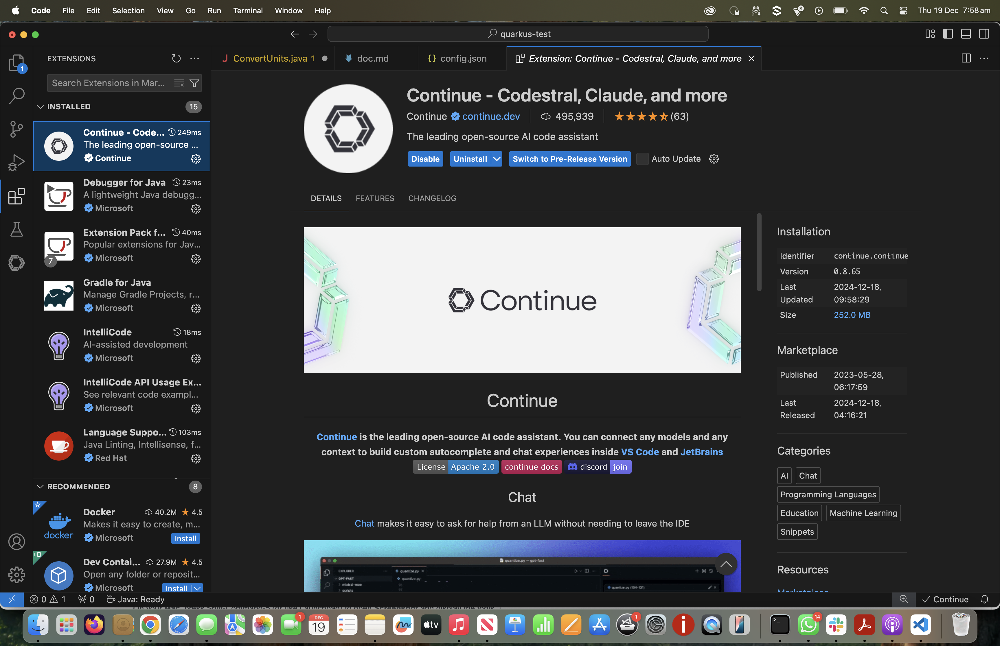
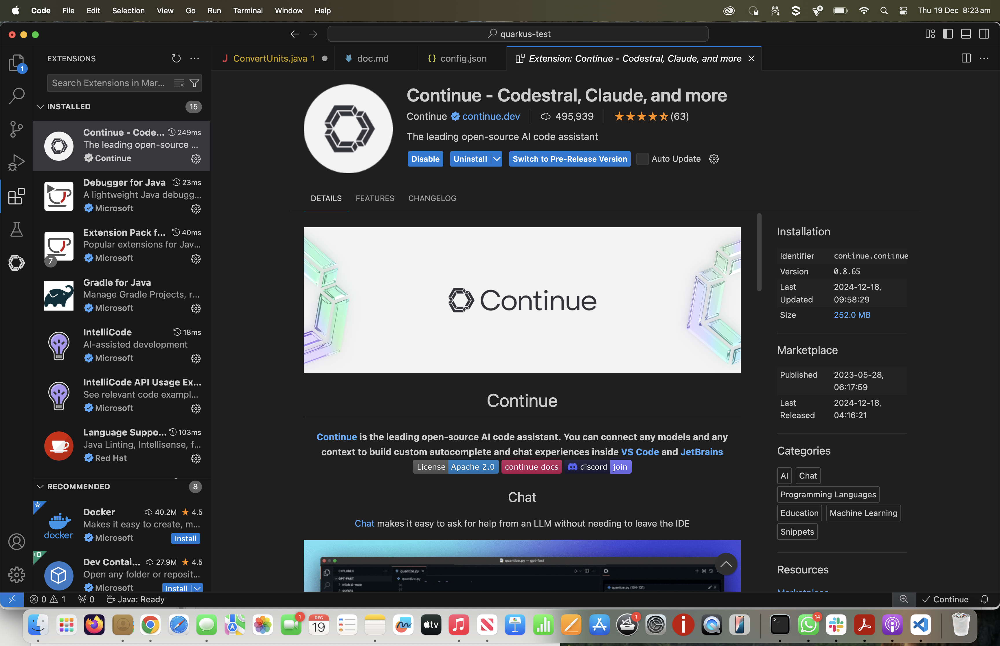
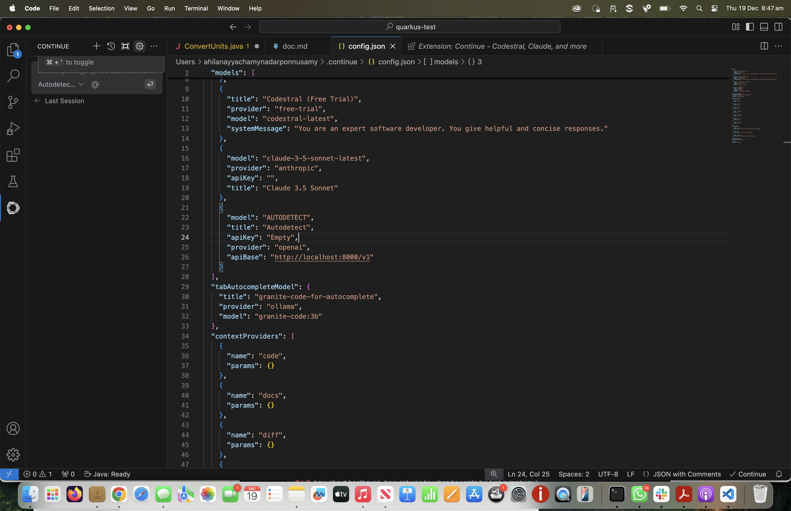
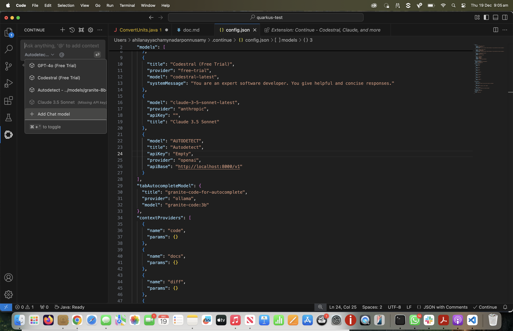

# Open source AI Code Assistant for Air Gapped Deployment

## Detailed explanation of this POC is provided in this [blog](https://medium.com/@ahilanp/part-iii-fine-tuning-beyond-the-buzz-highlighting-the-impact-of-ai-in-modernizing-application-74fb748d894b) ##

This POC shows how to leverage Granite code models for building an Open source AI code assistant for secured and Air gapped environemts. It uses VS Code as the IDE and continue.dev extension as the AI Code assistant and IBM Granite code models for chat and auto completion. 

## STEP 1: Install continue.dev VS Code Extension

1. Install continue.dev extension in VS Code 
>  
   

2. Once installed, you will see the continue.dev extension shown in the left side toolbar.
> 

## STEP 2: Download and Serve Granite code models for Chat and Code auto completion

3. For this POC we will be using two Granite code models
   1. **granite-8b-code-instruct-128k.Q5_K_M.gguf** model served by InstructLab for Chat.
   2. **granite-code:3b** model served by ollama for code completion.

 >[!NOTE]
 >You can also use the same model for both chat and code completion if you like. If you decide to use the same model for both chat and code completion, use ollama for serving the model as vLLM serving option seem to have some issues with code completion.

4. Download and serve the models in two different terminals as shown below
```
  $ ilab model serve --model-path models/granite-8b-code-instruct-128k.Q5_K_M.gguf

  $ ollama run granite-code:3b
```

## STEP 3: Configure Chat and Code auto completion models in continue extension.  

5. Select the Continue extension and click the Configure/Settings button located in the top-right corner of the Continue chat window. It will open the config.json file. 
> 

6. Add the following chat model configuration under the models section. This will enable the extension to automatically detect the Granite 8B code model served by InstructLab.

```
    {
      "model": "AUTODETECT",
      "title": "Autodetect",
      "apiKey": "Empty",
      "provider": "openai",
      "apiBase": "http://localhost:8000/v1"
    }
```
 >[!NOTE]
 >You can also use the 'Add Chat Model' option to add the model, as shown below. However, you'll still need to manually add the 'apiBase' property if you choose this approach.

>

7. Configure the Code auto complete model comfiguration to connect to granite 3b model by updating the tabAutocompleteModel section as shown below.

```
  "tabAutocompleteModel": {
    "title": "granite-code-for-autocomplete",
    "provider": "ollama",
    "model": "granite-code:3b"
  }
```

8. Save the confituration changes.
   
9. Wait for a minute for the configuration changes to take effect. If necessary, restart the extension by disabling and re-enabling it to ensure the changes are applied.

## Taking it for a spin

Follow this step-by-step guide to utilize the **Continue Extension** with the Granite model for creating and enhancing Java code:

---

## 1. Select the Granite Model
1. Open the **Continue Extension** chat window.
2. Select the Granite model from the dropdown.  
   - The model will appear as **“Autodetect-models/granite-8b…”**.


## 2. Create a Java Class for Unit Conversions
1. In the chat window, enter the following prompt:  "Can you create a new Java program called ConvertUnits.java which contains methods to convert imperial to metric for all units?"
2. The extension will generate the code and present the options: **Apply**, **Insert at Cursor**, and **Copy**.
3. Create a new Java file in VS Code and press **Apply** to insert the generated code into the file.


## 3. Explore Auto-Completion Features
### 3.1 Add Class Comments
1. Navigate to the top of the class and type `/**` to open a comment section.
2. Auto-completion will suggest class comments.  
- Press **Tab** to accept the suggestions.


### 3.2 Try Exception Handling Auto-Completion
1. Go to a method and type `if (`.  
- Auto-completion will suggest a **negative number validation check**.
- Press **Tab** to accept the suggestion.
2. Inside the condition, type a command to throw an exception.  
- The auto-completion will suggest throwing an **IllegalArgumentException** with a valid error message.


## 4. Generate Documentation in Markdown
1. In the chat window:
- Ensure the Granite model is selected.
- Press the **@** symbol and select the `ConvertUnits.java` file under the **Files** option to set it in context.
2. Enter the following prompt:  "Can you create markdown documentation? Please include details about all methods"
3. The extension will generate markdown documentation.
4. Use the **Copy** button to save the response as a markdown file.


## 5. Generate Test Cases or Improve Code
1. In the chat window, with the Granite model selected, set `ConvertUnits.java` in context using the **@** symbol.
2. Ask the model to:  
- Generate test cases:  
  ```
  Can you generate unit tests?
  ```
- Improve the code:  
  ```
  Can you optimize the methods?
  ```


## 6. Explore Additional Features
The Continue Extension offers many other capabilities.  
Refer to the **official documentation** to explore more features and maximize productivity.

---


***Your code assistant is ready, Have fun!!!!!***


