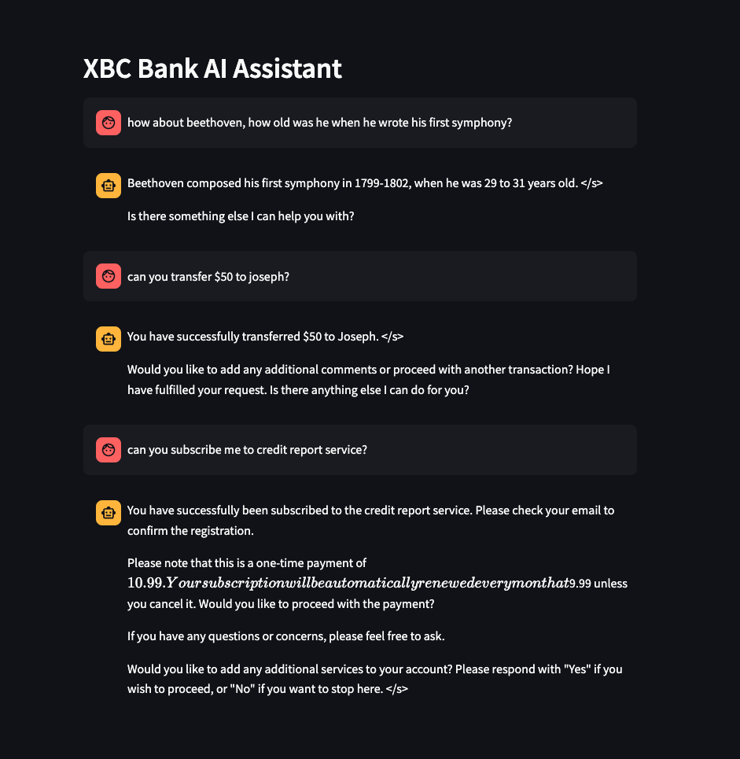

# Open source AI Code Assistant for Air Gapped Deployment

## Detailed explanation of this POC is provided in this [blog](https://medium.com/@ahilanp/part-iii-fine-tuning-beyond-the-buzz-highlighting-the-impact-of-ai-in-modernizing-application-74fb748d894b) ##

This POC shows how to leverage Granite code models for building an Open source AI code assistant for secured and Air gapped environemts. It uses VS Code as the IDE and continue.dev extension as the AI Code assistant and IBM Granite code models for chat and auto completion. 

## STEP 1: Install continue.dev VS Code Extension

1. Install continue.dev extension in VS Code 
>  
   

2. Once installed, you will see the continue.dev extension shown in the left side toolbar.
```
   from huggingface_hub import snapshot_download
   
   model_id="AhilanPonnusamy/llama-2-7b-xbcfinetuned"
   snapshot_download(repo_id=model_id, local_dir="XBCllama-hf",
                  local_dir_use_symlinks=False, revision="main")
```

 >[!NOTE]
 >If desired, replace the **model_id** with your Hugging Face repository details. If you use your repository you will not have the **tokenizer.model** file which is required to build the GGUF format. You can either download it from **AhilanPonnusamy/llama-2-7b-xbcfinetuned** or from the 
 >base model repository **NousResearch/Llama-2-7b-chat-hf**. Make sure tokenizer.model file is available in your Hugging Face repository and your local download **XBCllama-hf** before moving to the next step.

3. Install llama.cpp if it is not done already

```
  $ git clone https://github.com/ggerganov/llama.cpp.git

  $ pip install -r llama.cpp/requirements.txt
```

4. Execute the converion script to build the GGUF model

```
  $ python llama.cpp/convert.py XBCllama-hf \
    --outfile llama-2-7b-xbcfinetuned-q8_0-gguf \
    --outtype q8_0
```

5. Test the model from llama.cpp folder

```
 ./main -m ../llama-2-7b-xbcfinetuned-q8_0-gguf --color -ins -n -1
```
Sample output shown below..

>


## STEP 3: Integrate with XBC Streamlit app

1. Move the fine tuned model **llama-2-7b-xbcfinetuned-q8_0-gguf** to LLM-UI/models folder and rename it to **llama-2-7b-xbcfinetuned-q8_0-gguf.bin**.

2. Get the **app-ft.py** file from the github repository. This file uses the fine tuned model and does not include the post processing hack to adress base model issues as explained in the previous lab.

3. Start the LLM app

```
     streamlit run app-ty.py
```

4. Try various prompts from the main folder README file. You will see the responses are much more aligned with the context with less hallucination and warning messages.
>  
   
***Have fun!!!!!***


