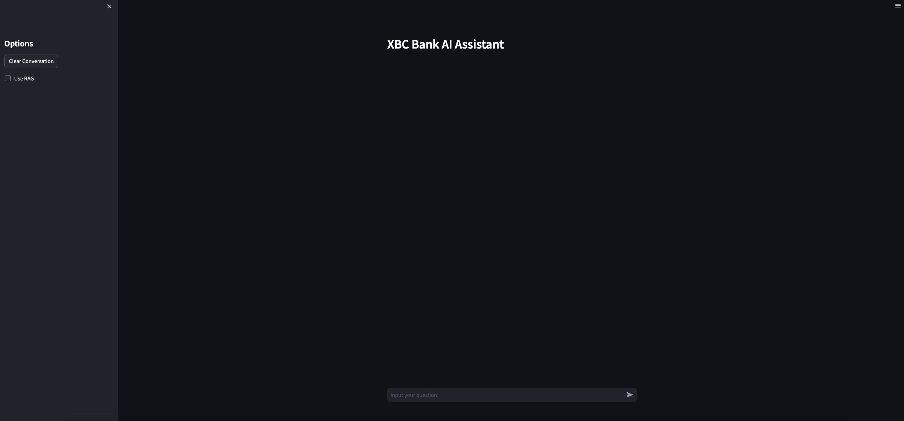
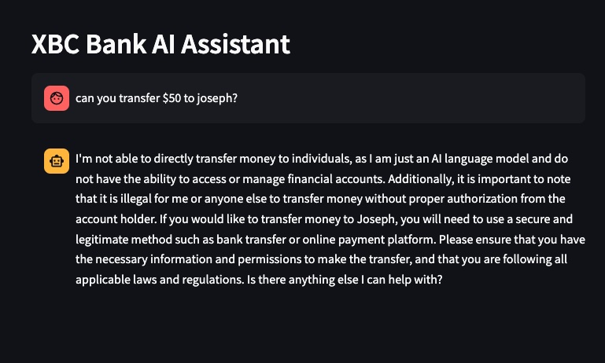
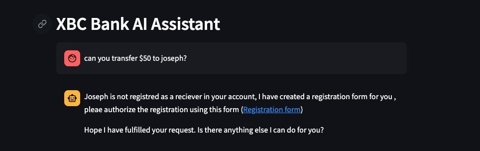

# LLM-and-AppModernization

Large Language Models (LLMs) are transforming the way we interact with software applications. This project, demonstrates how AI can modernize application interfaces.

For a detailed explanation of this proof of concept (POC), check out my [blog post](https://medium.com/@ahilanp/part-ii-poc-beyond-the-buzz-highlighting-the-impact-of-ai-in-modernizing-application-ff0c1e8efb87).

This guide provides instructions for configuring and running Llama2, with steps tailored for macOS but adaptable for Windows.

**System Specifications:**

- Device: MacBook Pro (Tested on macOS Monterey 12.3.1)
- Processor: 2.6 GHz 6-Core Intel Core i7
- RAM: 32 GB 2667 MHz DDR4
- [Windows alternative specifications]

## Prerequisites

1. Install Homebrew (macOS package manager):

```bash
/bin/bash -c "$(curl -fsSL https://raw.githubusercontent.com/Homebrew/install/HEAD/install.sh)"
```

2. Install Python (version 3.8 or higher) and other necessary tools:

```bash
brew install python wget git
```

3. Upgrade pip3 to the latest version (pip3 enables the installation and management of third party software packages that are used in this project)

```bash
python3 -m pip install --upgrade pip
pip install virtualenv
```

## Prerequisites

Before starting, ensure you have the necessary tools and environments set up:

1. **Install Homebrew**: Homebrew is a package manager that simplifies the installation of software on macOS. To install, run:

   ```bash
   /bin/bash -c "$(curl -fsSL https://raw.githubusercontent.com/Homebrew/install/HEAD/install.sh)"
   ```

2. **Install Python and Tools:** This project requires Python 3.8 or higher. Install Python along with wget and git using Homebrew:

```bash
brew install python wget git
```

**Note:** Windows users can download Python from the official Python website.

3. **Upgrade pip3 and Install virtualenv:** pip3 is a package manager for Python. Upgrade it to the latest version and install virtualenv for creating isolated Python environments:

```bash
python3 -m pip install --upgrade pip
pip install virtualenv
```

By following these steps, you'll have all the necessary tools and environments configured to begin working with the LLM-and-AppModernization project.

## Installation and Setup

4. **Clone the Repository:** Download the project code by cloning the repository and navigate to the `LLM-and-AppModernization` directory:

```bash
git clone https://github.com/AhilanPonnusamy/LLM-and-AppModernization.git
cd LLM-and-AppModernization
```

5. **Set Up a Virtual Environment:** To avoid conflicts with other Python projects, it's recommended to use a virtual environment. Create and activate a virtual environment named `llm_env`:

```bash
python3 -m venv llm_env
source llm_env/bin/activate
```

This will isolate your project's dependencies from your global Python environment.

6. **Install Required Packages:** The `requirements.txt` file lists all the Python packages needed for this project. Install them using the following command:

```bash
python3 -m pip install -r requirements.txt
```

This ensures that you have all the necessary libraries and tools installed.

1. **Download the Llama Model:** Download the `llama-2-7b-chat.Q5_K_M.gguf` file it into the `models` directory:

```bash
wget https://huggingface.co/TheBloke/Llama-2-7B-Chat-GGUF/resolve/main/llama-2-7b-chat.Q5_K_M.gguf -O models/llama-2-7b-chat.Q5_K_M.gguf
ls -l models/llama-2-7b-chat.Q5_K_M.gguf
```

Ensure that the file is correctly downloaded by checking its presence in the `models` directory with the `ls -l` command.

## Running the Application

Once the above steps are successfully completed, follow these steps to start and run the LLM-and-AppModernization application:

1. **Start the Backend Service:** First, you need to start the backend service which powers the application. This service manages the interactions with the Llama model. Make sure you are in the root directory of the project (`LLM-and-AppModernization`), then start the service using:

```bash
python3 restservice.py
```

Keep this terminal open as the service must continue running for the application to function.

2. **Open a New Terminal:** Now, open a new terminal window. This is necessary because you'll run the frontend part of the application while the backend service is still running.

3. **Activate the Virtual Environment (Again):** In the new terminal, navigate back to the project directory if you're not already there:

```bash
cd path/to/LLM-and-AppModernization
```

Reactivate the virtual environment `llm_env`:

```bash
source llm_env/bin/activate
```

4. **Run the Application:** With the virtual environment active, start the Streamlit application:

```bash
streamlit run app.py
```

This command will launch the application's user interface, typically in your default web browser.

5. **Access the Application:** After running the above command, Streamlit should automatically open the application in your web browser. If it doesn't, you can manually access it by navigating to the URL provided in the terminal output (usually `http://localhost:8501`).

## Troubleshooting

Here are some tips to help you resolve potential problems:

### Common Startup Errors

- **Issue:** Random errors during startup, such as `llm not loaded` or `broken chain`.
  - **Solution:** These errors usually occur due to temporary glitches. Simply restart the application to resolve these issues. If the problem persists, ensure all dependencies are correctly installed and that the backend service is running properly.

- **Issue:** The user interface (UI) starts with a light theme by default.
  - **Solution:** If you prefer a different theme, you can easily change it. Click on the settings icon in the top right corner of the UI and select your preferred theme. See the screenshot below for reference:
    

### Context Window Size Error

- **Issue:** You might encounter a `ValueError` related to the context window size, such as `ValueError: Requested tokens (613) exceed context window of 512`. This error occurs when the request to the model exceeds the maximum token limit it can process.
  - **Solution:** To fix this, you need to clear the existing conversation data to reduce the token count. Click on the 'Clear Conversation' button located on the left side of the UI. This will reset the conversation and allow you to continue without exceeding the token limit.

In case these solutions do not resolve your issues, consider checking the application logs for more detailed error messages or reaching out to the support community for further assistance.

## Testing

Now, that the application and the backend services are up and running, it is now time to take it for a spin.

1. With **Use RAG** option unselected, submit the following question **Can you transfer $50 to Joseph?**. Once submitted, you will see some activity in streamlit console and in about 45 seconds a generic LLM response is dislayed in the UI as shown below.


2. With **Use RAG** option selected, submit the same question **Can you transfer $50 to Joseph?** you will now see a more context aware message as shown below


3. You can try the following prompts to try with **Use RAG** option selected
     - Can you transfer $50 to Ram?
     - Can you transfer $580 to John?
     - Can you transfer $100 to Peter?
     - Can you add Joseph to my account?
     - Can you add Allan to my account?
     - Can you remove John from my account?
     - Can you remove Mark from my account?

***Have fun!!!!!***
